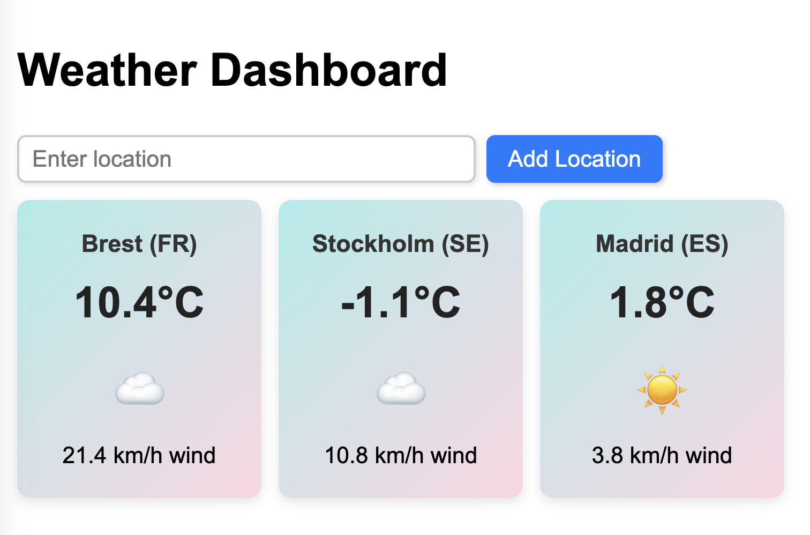

**Web Development Course - Day 4 Exercise: Building a Weather Web App**

## Objective
In this exercise, you will build a weather web application that allows users to sign up, log in, and manage their favorite locations for weather forecasts. The application will consist of a backend in Node.js with authentication and a frontend in HTML/CSS/JS displaying weather information fetched from Open-Meteo.

---

## **Project Requirements**

### **Backend (Node.js & MySQL)**
#### **1. Setup**
- Initialize a Node.js project with `npm init`
- Install required dependencies: 
  ```sh
  npm install express mysql2 dotenv bcryptjs jsonwebtoken cors body-parser axios
  ```
- Create a `.env` file for environment variables (e.g., database credentials, JWT secret)

#### **2. Database (MySQL)**
- Create a database called `weather_app`
- Create two tables:
  ```sql
  CREATE TABLE users (
    id INT AUTO_INCREMENT PRIMARY KEY,
    username VARCHAR(255) UNIQUE NOT NULL,
    password VARCHAR(255) NOT NULL
  );
  
  CREATE TABLE locations (
    id INT AUTO_INCREMENT PRIMARY KEY,
    user_id INT NOT NULL,
    city VARCHAR(255) NOT NULL,
    country VARCHAR(255),
    FOREIGN KEY (user_id) REFERENCES users(id)
  );
  ```

#### **3. Authentication**
- Implement user registration (hash password using `bcryptjs`)
- Implement login (verify password, return JWT token)

#### **4. Profile Management**
- Implement API to fetch user profile and saved locations
- Implement API to add a new location to the user’s list
- Implement API to delete a location

#### **5. Fetching Weather Data**
- Use `axios` to fetch weather data from Open-Meteo API
- Create an API route that retrieves weather data for stored locations

### **Frontend (HTML, CSS, JavaScript)**

#### **1. Setup**
- Create an HTML page with:
  - Login and registration forms
  - A dashboard to display weather widgets

#### **2. Authentication**
- Implement login and registration using fetch API to communicate with the backend
- Store the JWT token in `localStorage` for session management

#### **3. Dashboard**
- After login, fetch and display saved locations
- Show a weather widget for each location
- Implement a form to add new locations

#### **4. Interactions**
- Use JavaScript to dynamically update the dashboard when adding a new location
- Provide a delete button for each location to remove it from the user’s list

#### **5. Weather Widget**
- Each weather widget should display:
  - The temperature at the selected location
  - The current weather condition (e.g., sunny, cloudy, rainy)
  - The wind speed
- The first version will be implemented using plain HTML, CSS, and JavaScript
- The widget should update dynamically when new locations are added
- Use CSS to style the widget for a clean and user-friendly appearance

#### **6. Screenshot of Proposed Solution**
Below is an example screenshot of how the weather dashboard could look:



---

## **Step-by-Step Instructions**

### **Backend Implementation**
1. **Setup Express Server**
   - Create `server.js`
   - Set up Express with middleware for parsing JSON and handling CORS

2. **Database Connection**
   - Use `mysql2` to connect to the MySQL database
   - Load environment variables from `.env`

3. **User Authentication**
   - Implement `POST /register` to create new users
   - Implement `POST /login` to authenticate users and return a JWT

4. **Location Management**
   - Implement `GET /locations` to fetch user’s saved locations
   - Implement `POST /locations` to add a new location
   - Implement `DELETE /locations/:id` to remove a location

5. **Weather API Integration**
   - Create an endpoint `GET /weather` that retrieves and returns weather data for saved locations

### **Frontend Implementation**
1. **Login & Registration Forms**
   - Create HTML forms for login and registration
   - Use JavaScript `fetch()` to interact with backend endpoints

2. **Dashboard Layout**
   - Create a dashboard layout with a list of weather widgets
   - Each widget should display location name and current weather

3. **Fetching & Displaying Weather Data**
   - Use JavaScript to call the backend and retrieve weather data
   - Dynamically create and display weather widgets

4. **Adding & Removing Locations**
   - Implement a form to input city and country
   - Use `fetch()` to send requests to backend to add/remove locations
   - Update the dashboard dynamically without reloading the page

---

## **Bonus Features**
- Implement user logout functionality
- Improve UI with CSS styling
- Add error handling for API requests
- Allow users to edit location names

This exercise will give you hands-on experience with full-stack development using Node.js, MySQL, and JavaScript. Happy coding!


